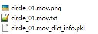

## Camera Calibration (for video)

1. Download Checkerboard for Camera Calibration: https://www.mrpt.org/downloads/camera-calibration-checker-board_9x7.pdf

   * Don't forget to print it **using A4 Paper**! Otherwise the size of squares is not corret.
   * Instead of number of cells, the 9x7 here actually means the points of intersection. So there is actually 10x8 cells, but the parameters filled in the code is `(9,7)`

2. Attach the printed checkerboard to a hardboard.

3. Hold the hardboard, record a video: **Slowly** move the board upside-down, left-right, turn around, turn with some angles etc... (just make sure all the cells are visible)

4. Once you get the video (i.e. `data/90fov.mp4`), you can run the calibration code

   
   
   * GUI has already been tested under Windows and Linux, but not Mac. 
   * The recorded video will store the sampling frames inside `dir_name`.	
   * Current sampling size is `random_num = 20`. 
   
5. The code will then output the camera matrix. The format already been tidied as capable for copy and paste. **This matrix will be used in next step**

   

   

## Tag Detection

1. Requirements: 
   * duckietown-Apriltags bindings https://github.com/duckietown/dt-apriltags
     * `pip install dt_apriltags`
   * Others: `pip install opencv-python numpy pandas scipy matplotlib`
   
2. Print [April Tags](https://april.eecs.umich.edu/software/apriltag) and attach it to the object you want to detect.
   * Pre-generated tag families: [apriltag-imgs](https://github.com/AprilRobotics/apriltag-imgs)
   * The pre-generated tag is png format, and relatively small. You can scale it with the script`scale_tags.sh`. The script will scale all the png files under current folder.
   * You would need to modify `tag_size` (m) to the actual size of your printed tag. (Suggestion: You can use Word to accurately modify tag size)
   
3. Get Video Tags Trajectory
   * Modify `run.py` as your needs. For first-time running, set `loadInfoDictFromPickle` as False, and all the other config as `True`.
   * 

4. Run `python run.py`. You will get the trajectory image, txt and pkl 

   
   
   * pickle file (pkl) will be useful when debugging and applying some other transformations.


### OSError? 

If met with OSError as the following during funning, add a parameter "searchpath" in `Detector()` like this

> OSError: /home/yanshimsi/.local/lib/python3.8/site-packages/dt_apriltags/libapriltag.so: cannot open shared object file: No such file or directory

Try to find where your libapriltag.so is located first (Mine is in `/usr/local/lib` after doing `sudo make install`), and then use the Detector as

```
from dt_apriltags import Detector
at_detector = Detector(searchpath=['/usr/local/lib'],
                        families='tag36h11',
                        nthreads=1,
                        quad_decimate=1.0,
                        quad_sigma=0.0,
                        refine_edges=1,
                        decode_sharpening=0.25,
                        debug=0)
```